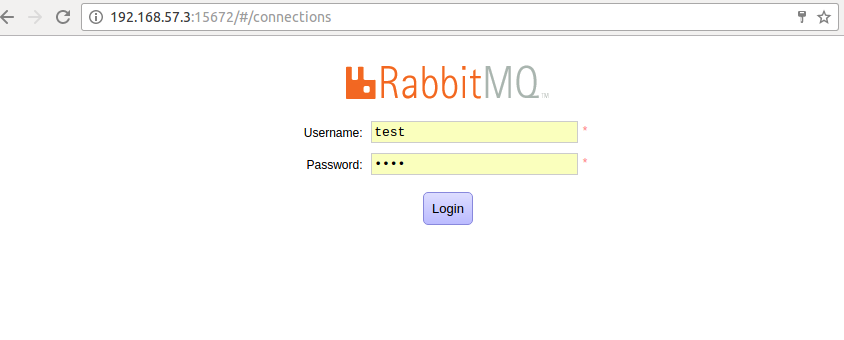
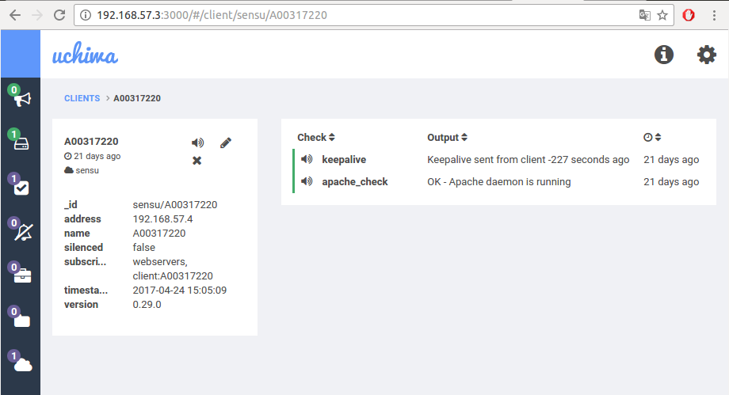

### Parcial 3 sistemas operativos

### Estudiantes: 
**Jorge Hernandez - A00317220**

**URL de github: //github.com/GeorgeArturo/so-exam3**

### Procedimiento

* **Instrucciones para la configuración del cliente**

Lo primero que se hizo para la instalación del cliente fue:

``` 
echo '[sensu]
name=sensu
baseurl=https://sensu.global.ssl.fastly.net/yum/$releasever/$basearch/
gpgcheck=0
enabled=1' | sudo tee /etc/yum.repos.d/sensu.repo

```

Luego se instalo sensu mediante los siguientes comandos:

```
yum install sensu -y
sensu-install -p sensu-plugin
```

El servicio del cliente se inicia mediante el siguiente comando:

```
service sensu-client start
```
El servicio de httpd se instalo mediante el siguiente comando

```
yum install httpd -y
```

* Para la parte de la configuración de rabbitmq se hizo lo siguiente 

```
cd /etc/sensu/conf.d
```
Una vez aqui se creo un archivo tipo json (client.json) con la siguiente información

```
{
  "client": {
    "name": "A00317220",
    "address": "192.168.57.4",
    "subscriptions": ["webservers"]
  }
}

```

Luego se creo otro archivo tipo json (rabbitmq.json) con la siguiente información:

```
{
  "rabbitmq": {
    "host": "192.168.57.3",
    "port": 5672,
    "vhost": "/sensu",
    "user": "sensu",
    "password": "password",
    "heartbeat": 10,
    "prefetch": 50
  }
}

```

Finalmente se instalaron algunos plugins para el correcto funcionamiento, para esto lo que se hizo fue:

```
cd /etc/sensu/plugins
```

una vez en esta direccion se creo un archivo ruby (check-apache.rb) con la siguiente información

```
#!/usr/bin/env ruby

procs = `ps aux`
running = false
procs.each_line do |proc|
  running = true if proc.include?('httpd')
end
if running
  puts 'OK - Apache daemon is running'
  exit 0
else
  puts 'WARNING - Apache daemon is NOT running'
  exit 1
end

```

* **Instrucciones para la configuración del servidor**

Lo primero que se hizo para la instalación del servidor fue:


```
echo '[sensu]
name=sensu
baseurl=https://sensu.global.ssl.fastly.net/yum/$releasever/$basearch/
gpgcheck=0
enabled=1' | sudo tee /etc/yum.repos.d/sensu.repo
```

Se realizo la instalación de sensu mediante los siguientes comandos 

```
yum install sensu -y
sensu-install -p sensu-plugin
sensu-install -p sensu-plugins-slack
su -c 'rpm -Uvh http://download.fedoraproject.org/pub/epel/7/x86_64/e/epel-release-7-9.noarch.rpm'
```

Se instalo erlang

```
yum install erlang -y
```

Se instalo redis

```
yum install redis -y
```
Iniciar el servicio redis
```
service redis start
```

Se instalo socat
```
yum install socat -y
```

* Configuración del servicio de rabbitmq

```
su -c 'rpm -Uvh http://www.rabbitmq.com/releases/rabbitmq-server/v3.6.9/rabbitmq-server-3.6.9-1.el7.noarch.rpm'
service rabbitmq-server start
rabbitmqctl add_vhost /sensu
rabbitmqctl add_user sensu password
rabbitmqctl set_permissions -p /sensu sensu ".*" ".*" ".*"
rabbitmq-plugins enable rabbitmq_management
chown -R rabbitmq:rabbitmq /var/lib/rabbitmq

```

A continuación para probar el funcionamiento de rabbitmq se configura un usuario

```
rabbitmqctl add_user test test
rabbitmqctl set_user_tags test administrator
rabbitmqctl set_permissions -p / test ".*" ".*" ".*"

```

* A continuación como fue el proceso de configuración de uchiwa

```
yum install uchiwa -y
```

Para poder utilizar estos servicios es necesario abrir los siguientes puertos:

```
firewall-cmd --zone=public --add-port=5672/tcp --permanent
firewall-cmd --zone=public --add-port=15672/tcp --permanent
firewall-cmd --zone=public --add-port=3000/tcp --permanent
firewall-cmd --reload
```

Finalmente se reinician los servicios

```
service sensu-server restart
service sensu-api restart
service uchiwa restart

```

**A continuación se muestra una prueba del funcionamiento de rabbitmq y de sensu**

* Prueba de funcionamiento de Rabbitmq

* Prueba 1



* Prueba 2


* Prueba de funcionamiento de uchiwa


